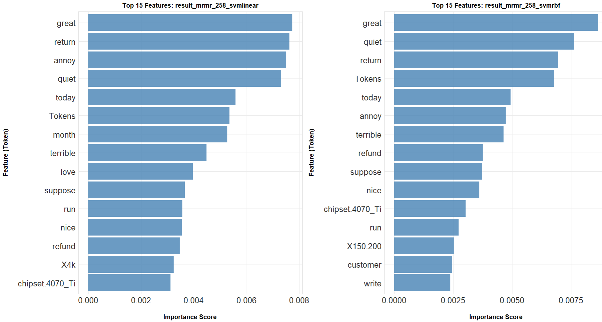

# TF-IDF vs. Word2Vec for Sentiment Classification of Technical Product Reviews

### A Case Study on 2,989 Amazon Reviews of NVIDIA RTX 40 Series Graphics Cards

**Author:** Kai-Tih Hong (洪凱迪) · M.S. in Statistics, National Taipei University · July 2025
**Advisor:** Dr. Yi-Ting Hwang

> **TL;DR** — On jargon-dense GPU reviews, semantic word embeddings beat classic frequency-based features: the best Word2Vec model detected **73.5%** of negative reviews vs. **62.6%** for the best TF-IDF model on the held-out test set (a **+17% relative improvement**), a result validated across 300 cross-validation splits with Friedman + Dunn's tests. The pipeline doubles as a market-intelligence engine: it automatically surfaced "coil whine," dead-on-arrival, and refund friction as the dominant drivers of negative sentiment.

---

## Executive Summary

High-end graphics cards are expensive, technically complex products. Most buyers cannot evaluate specifications like VRAM bandwidth or cooler acoustics before purchase, so they rely heavily on online reviews — a textbook case of information asymmetry. For manufacturers, those same reviews are an untapped, real-time stream of product feedback. The bottleneck is scale: thousands of unstructured, jargon-heavy texts that no team can read manually.

This study asks a practical question: **when the text is full of domain-specific terminology, which text-representation strategy classifies sentiment better — the traditional frequency-based TF-IDF, or the semantic embedding model Word2Vec?**

Using 2,989 U.S. Amazon reviews of NVIDIA RTX 40 series cards, I benchmarked **52 model configurations**: two feature-engineering families (TF-IDF with Mutual Information or mRMR feature selection at 5 dimensionalities × Word2Vec at 3 dimensionalities) crossed with four classifiers (SVM Linear, SVM RBF, Random Forest, XGBoost). Because missing a negative review costs a manufacturer far more than misreading a positive one, **recall on the negative class was the primary metric**, with F1 as the balance check.

**Key findings:**

1. **Word2Vec wins decisively.** The statistically top-performing group (per Dunn's post-hoc test over 300 CV splits) is dominated by Word2Vec configurations: 9 of the 12 best models by recall, and 7 of the 8 best by F1.
2. **Word2Vec + XGBoost is the best negative-review detector** (test recall 0.735); **Word2Vec + SVM RBF gives the best precision/recall balance** (F1 up to 0.694).
3. **If you must use TF-IDF, use mRMR at low dimensionality.** mRMR-selected 258-dim features reached 0.626 recall — but performance *decayed* as dimensions grew (down to 0.361 at 1,292 dims). Feature redundancy, not feature scarcity, was the binding constraint.
4. **The same pipeline generates product intelligence for free.** Bigram network analysis and word-vector clustering exposed concrete, actionable complaint themes — hardware acoustics ("coil whine", the single most frequent bigram at 170 mentions), delivery failures ("dead on arrival"), and post-purchase friction (refund / RMA / customer service).

The method generalizes to any review corpus in any technical product category — GPUs, laptops, cameras, appliances — and provides a template for building an automated voice-of-customer monitoring system.

---

## 1. Why GPU Reviews Are Worth Analyzing

The GPU market moves fast: new architectures, AI-driven demand, and steep prices (the RTX 40 series spans roughly $300 to $2,000). Three properties make its reviews an ideal stress test for NLP methods — and a valuable business asset:

- **High information asymmetry.** Buyers can't test thermals, noise, or driver stability before purchase, so review sentiment directly shapes conversion. Negative reviews on a $1,600 product are disproportionately costly.
- **Jargon density.** Reviews are packed with low-frequency technical terms — *coil whine, DLSS, VRAM, form factor, ray tracing* — exactly the vocabulary where frequency-based methods struggle and semantic embeddings should shine.
- **Actionability.** Complaints map to concrete engineering and operations levers: acoustics (coil whine), packaging/QA (dead on arrival), sizing (case clearance), and after-sales service (RMA).

If a method works here, it works on easier corpora.

## 2. Data

**Source:** U.S. Amazon product reviews for NVIDIA RTX 40 series graphics cards (ASUS, GIGABYTE, MSI), collected via web scraping.

| Property | Value |
|---|---|
| Final sample (after preprocessing) | **2,989 reviews** |
| Train / test split | 2,092 / 897 (stratified 70/30) |
| Label definition | 1–3 stars → **BAD**, 4–5 stars → **GOOD** |
| Class ratio (GOOD : BAD) | ≈ 4.76 : 1 (2,470 vs. 519) — heavily imbalanced |
| Training corpus size | 63,309 tokens, 6,532 unique terms |
| Brand coverage | GIGABYTE 40.1%, ASUS 33.5%, MSI 26.5% |
| Chipset coverage | Full RTX 40 range; top: 4060 (19.4%), 4090 (16.5%), 4070 (16.0%) |

Reviews include metadata — brand, chipset, and VRAM (one-hot encoded), review length, helpful votes, image/video counts, and physical card volume (L×W×H, a thermal-design proxy) — that was merged with text features into hybrid feature sets for every model configuration. The 4.76:1 class imbalance is not a nuisance — it *is* the business problem: negative reviews are rare, and rare events are the ones worth detecting.

## 3. Methodology

### 3.1 The pipeline at a glance

```
Raw reviews
  → Preprocess (clean → tokenize → stop words → lemmatize → domain correction)
  → Represent text
      ├── Path A: TF-IDF (2,748 terms) → feature selection (MI or mRMR)
      │            → 258 / 517 / 776 / 1,034 / 1,292 dims   (10 feature sets)
      └── Path B: Word2Vec (Skip-gram) → mean word vectors
                   → 100 / 200 / 300 dims                    (3 feature sets)
  → + metadata features
  → Train 4 classifiers × 13 feature sets = 52 configurations
  → Evaluate: recall-first, then F1 · 30 × 10-fold CV · Friedman + Dunn's tests
```

### 3.2 Preprocessing

Standard NLP hygiene (R: `quanteda`, `stopwords`, `textstem`), with two domain-specific additions worth highlighting:

1. **Custom stop words** — generic product terms carrying no sentiment signal (*card, rtx, gpu, nvidia*) were added to the snowball/smart dictionaries.
2. **Domain lexical correction** — abbreviations were normalized to their canonical forms (*fp → fps*, *temp → temperature*, *trace → tracing*), compensating for general-purpose NLP tools' blindness to hardware slang.

Lemmatization was chosen over stemming to preserve word semantics (critical for Word2Vec). 24 reviews became empty after filtering and were removed.

### 3.3 Two competing text representations

| | **TF-IDF** | **Word2Vec (Skip-gram)** |
|---|---|---|
| Core idea | A word matters if it's frequent in this document but rare elsewhere | A word's meaning is defined by the company it keeps |
| Output | Sparse vector, one dimension per vocabulary term | Dense vector (100–300 dims) encoding semantic proximity |
| Understands that *"terrible"* ≈ *"awful"*? | No — different strings, different dimensions | Yes — neighboring vectors |
| Handles rare jargon (*coil whine, DLSS*)? | Weakly — rare terms get noisy weights | Well — Skip-gram is explicitly stronger on low-frequency words |
| Dimensionality problem | 2,748 sparse dims → needs feature selection | Built-in: dimensionality is a training parameter |

**TF-IDF path.** IDF weights were fit on the training set only (strict fit-transform, no leakage). Because the raw matrix is high-dimensional and sparse, two feature-selection algorithms were compared, each keeping the top 10/20/30/40/50% of terms (258–1,292 dims):

- **Mutual Information (MI):** rank terms by how much their presence reduces uncertainty about the label. Simple, but ignores redundancy between selected terms.
- **mRMR (minimum Redundancy Maximum Relevance):** maximize label relevance *while penalizing* correlation with already-selected terms — a leaner, less collinear feature set.

**Word2Vec path.** Skip-gram (window 7, negative sampling 7, 45 iterations) was trained at 100, 200, and 300 dimensions; each review was represented by the mean of its word vectors.

### 3.4 Classifiers and evaluation

Four classifiers spanning the main model families: **SVM (Linear)**, **SVM (RBF)**, **Random Forest**, **XGBoost**. Hyperparameters were tuned by randomized search (30 sampled configurations per model, selected by mean CV recall with F1 as tiebreaker). Class imbalance was handled at the evaluation-design level: the ~4.76:1 GOOD:BAD ratio was preserved by stratification in both the train/test split and every CV fold, and models were selected recall-first so the rare negative class drives optimization. Resampling techniques such as SMOTE were deliberately left as future work (see §7).

**Recall-first evaluation.** In this application, a false negative (missing a real complaint) is far more expensive than a false positive (flagging a happy customer for review). Models were therefore ranked primarily by **recall on the BAD class**, with **F1** as the secondary, balance-oriented criterion.

**Statistical rigor.** Single test-set numbers can flatter a lucky model. All 52 configurations were re-evaluated on **300 identical CV splits (30 × 10-fold)**, compared with a **Friedman omnibus test**, and — upon significance — pairwise **Dunn's post-hoc tests with Holm correction** against the top-ranked model. Models statistically indistinguishable from the best form the "top group."

## 4. Results

### 4.1 Headline comparison (held-out test set)

| Architecture | Best configuration | Recall (BAD) | Notes |
|---|---|---|---|
| **Word2Vec** | 300 dims + **XGBoost** | **0.735** | Best of all 52 configurations |
| TF-IDF + mRMR | 258 dims + SVM Linear | 0.626 | Best TF-IDF result |
| TF-IDF + MI | 258 dims + XGBoost | 0.619 | Stable (0.594–0.619) across dims |

Word2Vec + XGBoost detects **73.5% of negative reviews**, a **+17.4% relative improvement** over the best TF-IDF configuration. For F1, Word2Vec + SVM RBF led with **0.694** (300 dims).


### 4.2 The differences are statistically real

The Friedman test rejected equality of the 52 models overwhelmingly (recall: χ²(51) = 11,827, *p* < 0.001; F1: χ²(51) = 9,811, *p* < 0.001). Dunn's post-hoc tests then identified the models statistically tied with the best performer:

- **Recall top group (12 models):** benchmark = TF-IDF mRMR 517 + SVM RBF (median 0.757). **9 of 12 members are Word2Vec configurations**; the only TF-IDF survivors are low-dimensional mRMR sets (258/517 dims).
- **F1 top group (8 models):** benchmark = Word2Vec 100 + SVM RBF (median 0.684). **7 of 8 members are Word2Vec configurations**; the top seven are all Word2Vec + SVM/Random Forest.

The pattern is consistent: semantic embeddings provide a stable, high-quality feature foundation for *every* classifier family, while TF-IDF stays competitive only after aggressive redundancy-aware pruning.

### 4.3 Three second-order findings

**1. mRMR exhibits a "dimensionality decay" effect.** With mRMR features, SVM Linear's recall *fell* from 0.626 (258 dims) to 0.361 (1,292 dims). More features actively diluted the signal — a caution against the "more features = better" instinct, and evidence that redundancy control is what makes TF-IDF viable at all. Notably, the decay hits SVMs hardest while the tree ensembles stay nearly flat — their built-in feature subsampling absorbs the redundancy that cripples margin-based models.


**2. Classifier choice should follow the business objective.** XGBoost's residual-boosting mechanism makes it most sensitive to the rare negative class (best recall); SVM RBF exploits the nonlinear structure of embedding space for the best precision/recall balance (best F1). One pipeline, two deployment profiles.


**3. Random Forest overfits dense embeddings.** Near-perfect training recall (~1.0) collapsed to 0.665–0.690 on test data — the largest generalization gap of any classifier. XGBoost showed the smallest gap in the TF-IDF experiments.

## 5. From Classification to Market Intelligence

A sentiment classifier that only outputs labels is half a product. The same pipeline yields *why* customers are unhappy.

### 5.1 What the corpus says

The single most frequent bigram in the entire corpus — ahead of any positive phrase — is **"coil whine" (170 mentions)**: an electrical hum under load, and a concrete acoustics/QA engineering target. Positive language centers on *work great, highly recommend, run cool, easy install*; performance-context phrases (*max setting, ultra setting, frame rate*) show buyers stress-test their cards immediately.

Bigram network analysis reveals an asymmetry with practical consequences:

- **Positive reviews are linguistically concentrated** — a single hub ("great") with satellites for performance, thermals, and noise. Easy to model, few surprises.
- **Negative reviews are fragmented into distinct problem clusters** — hardware defects (coil whine), after-sales friction (*customer service, return*), power delivery (*power supply, cable*), and driver issues (*driver, update*). Each cluster is a different owner inside a company: QA, support, accessories, software.

### 5.2 A monitoring dictionary, validated by the models

Feature-importance analysis of the top TF-IDF models (mRMR 258 dims + SVM Linear / SVM RBF; thesis Fig. 6.2.1) quantifies which features actually drive classification: *great, quiet, love* on the positive side; **return, annoy, terrible, refund** as the shared vocabulary of complaint. Notably, two non-text features also reach the top 15 — **`Tokens`** (review length) and **`chipset.4070_Ti`**, which the thesis flags as a product-tier "hotspot" term — direct evidence that the hybrid text + metadata features carry real signal.



Projecting the Word2Vec vectors to 2-D (PCA) shows semantically coherent clusters — a "defect & return" region (*faulty, return, refund*), a "gaming performance & specs" region (*cyberpunk, vram, dlss, core, memory*), and a "physical fit" region (*form, factor, size, small, large*).

**Practical use:** these validated keyword sets form a monitoring dictionary that can be deployed today on CRM tickets, community forums, and social channels for real-time triage and topic routing — no model retraining required.

### 5.3 Recommended production setup

For a GPU manufacturer or retailer building an automated review-analysis system:

1. **Detection layer:** Word2Vec (300 d) + XGBoost, tuned for recall — catch as many negative signals as possible.
2. **Balanced layer:** Word2Vec + SVM RBF for dashboard-grade sentiment metrics where precision matters equally.
3. **Explanation layer:** bigram networks + embedding clusters, refreshed periodically, to convert flagged reviews into ranked, owner-assigned issue themes (acoustics → hardware QA; RMA friction → support ops; case-fit complaints → product design/marketing copy).

## 6. Reusing This Playbook in Other Industries

Nothing in the pipeline is GPU-specific. To transfer it to another domain (laptops, appliances, skincare, SaaS reviews):

1. **Relabel pragmatically.** Star ratings → binary labels; put the 3-star middle band wherever your business draws the dissatisfaction line.
2. **Invest in the domain lexicon first.** The custom stop-word list and abbreviation-correction map were the highest-leverage preprocessing steps here; every domain has its equivalents (e.g., *battery ≠ stop word* for laptops).
3. **Default to embeddings + gradient boosting** for detection; keep low-dimensional mRMR TF-IDF as the interpretable/lightweight fallback — it trains in seconds and its features are human-readable words.
4. **Rank models by the metric your economics dictate.** Recall-first is right when missed complaints are expensive; F1-first when analyst time to review flags is the constraint.
5. **Always validate with repeated CV + nonparametric tests** before claiming one method "wins" — single-split leaderboards routinely mislead.

## 7. Limitations & Future Work

**Limitations.** Amazon's API caps retrieval at ~100 reviews per product, biasing samples for popular items (sampling bias); results come from one platform, one product line, and English text only. Findings should be read as a rigorous case study, not a universal ranking.

**Why classical methods (and not BERT)?** The benchmark was deliberately scoped to pre-transformer methods: TF-IDF features are human-readable words (a compliance and stakeholder-communication advantage), and both feature families train at a fraction of transformer cost. As the thesis notes (citing Wang & Manning, 2012), well-tuned linear models over bag-of-words/TF-IDF features can rival far more complex models on some datasets — making them the right baseline to beat before reaching for heavier architectures. The known trade-off, also acknowledged in the thesis, is that these representations ignore word order and negation (e.g., "not bad").

**Deployment caveat.** One metadata feature, `Helpful` (community votes), accumulates *after* a review is posted; a newly scraped review always starts at 0. A production system should expect this feature to contribute less signal at inference time than it did in training.

**Future directions.**

- **Threshold tuning:** lowering the decision threshold below 0.5 (guided by the precision–recall curve) can buy additional recall where missed complaints are costly.
- **Imbalance techniques:** SMOTE-style synthetic oversampling of the minority class.
- **Transformer models:** BERT-family encoders would add contextual understanding (word order, negation, sarcasm) beyond what static embeddings capture — the natural next benchmark.

---

## Appendix A — 中文摘要 (Abstract in Traditional Chinese)

圖形處理器（GPU）市場因技術變革與新興需求而快速演進，消費者選購規格複雜的高單價顯卡時面臨顯著的資訊不對稱，決策高度依賴線上評論。本研究以美國 Amazon 平台 NVIDIA RTX 40 系列顯示卡評論（N = 2,989）為資料，比較傳統詞頻統計模型（TF-IDF，搭配互資訊與 mRMR 特徵選取）與詞嵌入技術（Word2Vec）在情感分類任務上的效能，共測試 52 組模型組合，並以 30 次重複 10 摺交叉驗證搭配 Friedman 與 Dunn's 檢定驗證顯著性。實證結果顯示，能捕捉語義關係的 Word2Vec 顯著優於 TF-IDF：「Word2Vec + XGBoost」在偵測負面評論上召回率最高（0.735），「Word2Vec + SVM RBF」則於 F1 分數表現最佳；TF-IDF 框架下 mRMR 於低維度展現較高效率。本研究亦透過詞組網路與詞向量視覺化，自動識別出「電流聲（coil whine）」、「到貨即損（DOA）」與退貨／維修等負面評論核心主題，為製造商提供一套數據驅動的市場意見分析方法。

**關鍵字：** 顯示卡、自然語言處理、特徵選擇、機器學習、文本分類

## Appendix B — Selected References

1. Mikolov, T., et al. (2013). Efficient estimation of word representations in vector space. *ICLR Workshop*.
2. Chen, T., & Guestrin, C. (2016). XGBoost: A scalable tree boosting system. *KDD '16*, 785–794.
3. Peng, H., Long, F., & Ding, C. (2005). Feature selection based on mutual information: criteria of max-dependency, max-relevance, and min-redundancy. *IEEE TPAMI, 27*(8).
4. Demšar, J. (2006). Statistical comparisons of classifiers over multiple data sets. *JMLR, 7*, 1–30.
5. Jurafsky, D., & Martin, J. H. (2023). *Speech and Language Processing* (3rd ed.).
6. Akerlof, G. A. (1970). The market for "lemons": Quality uncertainty and the market mechanism. *Quarterly Journal of Economics, 84*(3), 488–500.
7. Chevalier, J. A., & Mayzlin, D. (2006). The effect of word of mouth on sales: Online book reviews. *Journal of Marketing Research, 43*(3), 345–354.

---

*This document is a condensed, business-oriented adaptation of the author's Master's thesis (100 pages, National Taipei University, Department of Statistics, 2025). Full statistical tables (52-model benchmarks across all dimensionalities) are published in [`RESULTS.md`](./RESULTS.md); the complete methodology is in [`METHODOLOGY.md`](./METHODOLOGY.md). The analysis was conducted in R — see this repository's `src/` directory.*
