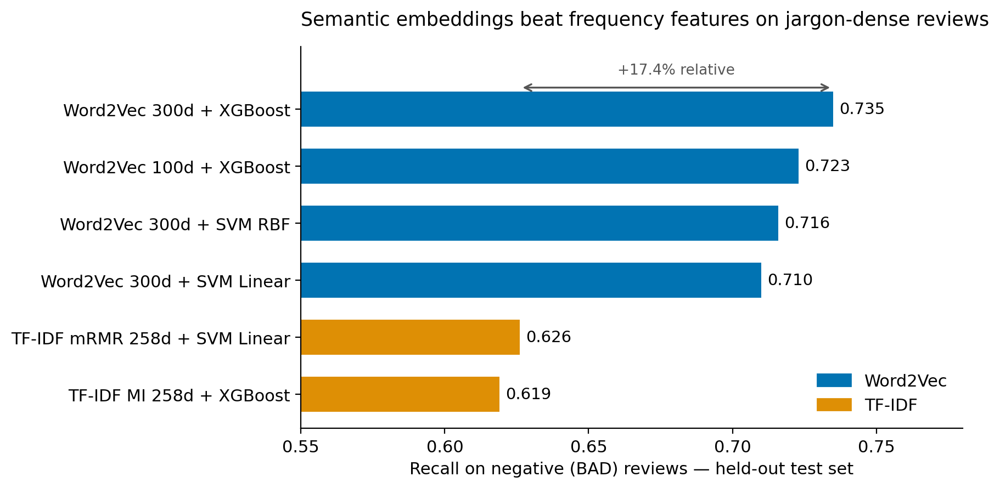
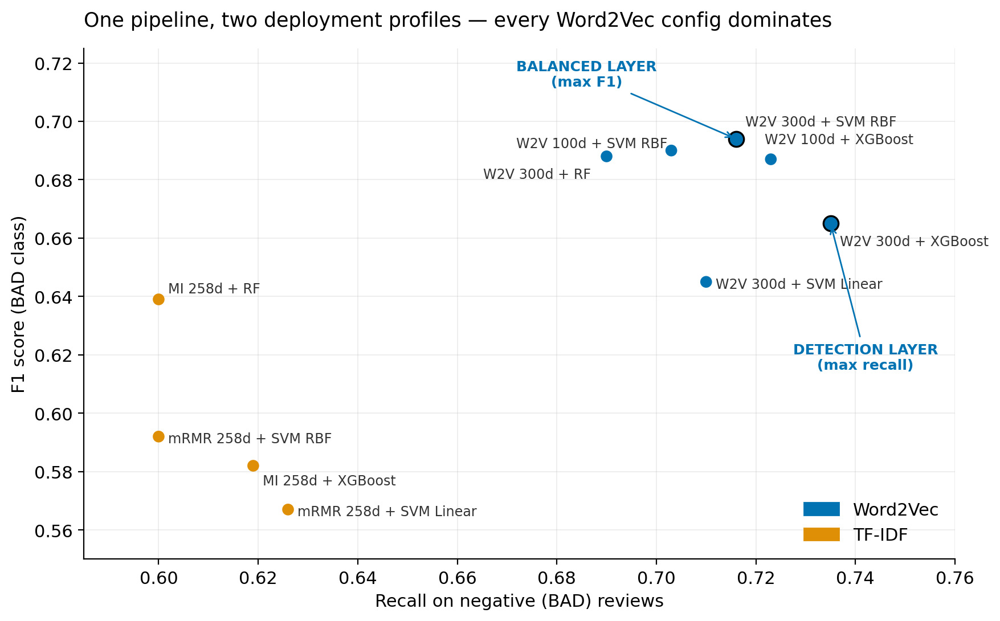

# 📊 Comparative Analysis of TF-IDF vs. Word2Vec for Sentiment Classification

### A Case Study on NVIDIA RTX 40 Series GPU Reviews from Amazon

> **碩士論文** ｜ 國立臺北大學統計學系  
> **Author:** Kai-Tih Hong (洪凱迪)  
> **Advisor:** Dr. Yi-Ting Hwang (黃怡婷 博士)  
> **Date:** July 2025


---

## 🎯 TL;DR

- Built an **end-to-end NLP pipeline** to classify 2,989 Amazon GPU reviews into positive/negative sentiment
- **Word2Vec (Skip-gram) significantly outperformed TF-IDF** across all classifiers — validating semantic embedding superiority in domain-specific text
- Best recall for detecting negative reviews: **Word2Vec + XGBoost → 73.5% recall**
- Best balanced performance: **Word2Vec + SVM RBF → F1 = 0.694**
- mRMR feature selection proved more efficient than Mutual Information for TF-IDF pipelines

---

## 📋 Table of Contents

- [Business Context](#-business-context)
- [Research Questions](#-research-questions)
- [Data Overview](#-data-overview)
- [Methodology](#-methodology)
- [Key Results](#-key-results)
- [Business Applications](#-business-applications)
- [Tech Stack](#-tech-stack)
- [Repository Structure](#-repository-structure)
- [Detailed Documentation](#-detailed-documentation)
- [About the Author](#-about-the-author)

---

## 💡 Business Context

The GPU market has undergone rapid transformation driven by crypto mining, pandemic-era gaming demand, and generative AI adoption. For high-ticket, spec-complex products like graphics cards, consumers rely heavily on **online reviews** to bridge the information asymmetry gap.

**The Challenge:** How can manufacturers systematically extract actionable insights from thousands of unstructured reviews to improve products and customer satisfaction?

This research addresses this challenge by comparing two mainstream text representation methods — **TF-IDF** (statistical) vs. **Word2Vec** (semantic) — to determine which better captures consumer sentiment in highly technical product reviews.

---

## 🔬 Research Questions

1. Which text representation method — TF-IDF or Word2Vec — better captures technical, jargon-intensive consumer opinions for sentiment classification?
2. Do different feature selection methods (MI vs. mRMR) produce significant performance differences?
3. What is the optimal combination of text representation and ML classifier for this domain?

---

## 📦 Data Overview

| Attribute | Detail |
|---|---|
| **Source** | Amazon US (verified purchases only) |
| **Products** | NVIDIA RTX 40 Series GPUs |
| **Brands** | MSI (26.5%), ASUS (33.5%), GIGABYTE (40.0%) |
| **Time Range** | Oct 2022 – Apr 2025 |
| **Total Reviews** | 2,989 (after preprocessing) |
| **Label Distribution** | Positive (GOOD): 82.6% \| Negative (BAD): 17.4% |
| **Train/Test Split** | 70/30 stratified |

### 🔍 Top Consumer Concerns (Bigram Analysis)

| Rank | Bigram | Frequency | Insight |
|---|---|---|---|
| 1 | coil whine | 170 | #1 hardware defect complaint |
| 2 | work great | 130 | Core positive expression |
| 3 | play game | 106 | Primary use case |
| 4 | max setting | 102 | Performance benchmark focus |
| 5 | power supply | 97 | Compatibility concern |

---

## ⚙️ Methodology


### Text Preprocessing Pipeline
1. **Standardization** — Lowercase, remove URLs/HTML/emojis/numbers
2. **Tokenization** — Split text into word tokens
3. **Stop Word Removal** — Snowball + SMART dictionaries + domain-specific terms
4. **Lemmatization** — Restore words to base form (e.g., "running" → "run")
5. **Domain Correction** — Map domain abbreviations (e.g., "fp" → "fps")

### Feature Engineering: Two Parallel Approaches

| Approach | Method | Dimensions Tested |
|---|---|---|
| **TF-IDF** + MI Feature Selection | Statistical word importance weighting | 258, 517, 776, 1034, 1292 |
| **TF-IDF** + mRMR Feature Selection | Min-redundancy max-relevance filtering | 258, 517, 776, 1034, 1292 |
| **Word2Vec** (Skip-gram) | Semantic word embedding | 100, 200, 300 |

### Machine Learning Models (4 classifiers × 13 feature sets = 52 configurations)

| Model | Type | Why Selected |
|---|---|---|
| **SVM Linear** | Linear classifier | Baseline for high-dimensional text |
| **SVM RBF** | Non-linear classifier | Explores non-linear decision boundaries |
| **Random Forest** | Bagging ensemble | Robust feature importance analysis |
| **XGBoost** | Boosting ensemble | State-of-the-art gradient boosting |

**Validation:** 10-fold stratified cross-validation × 30 repeats = 300 evaluation rounds per model

---

## 📈 Key Results

### 🏆 Best Models by Objective

| Objective | Best Configuration | Performance |
|---|---|---|
| **Max Negative Detection** (Recall) | Word2Vec 300d + XGBoost | **Recall = 0.735** |
| **Balanced Performance** (F1) | Word2Vec 300d + SVM RBF | **F1 = 0.694** |
| **Best TF-IDF** (Recall) | mRMR 258d + SVM Linear | Recall = 0.626 |



### Word2Vec vs. TF-IDF Performance Comparison

#### Word2Vec Results (300 dimensions)

| Model | Accuracy | Precision | Recall | F1 Score |
|---|---|---|---|---|
| SVM Linear | 0.865 | 0.591 | 0.710 | 0.645 |
| **SVM RBF** | **0.891** | **0.673** | 0.716 | **0.694** |
| Random Forest | 0.892 | 0.686 | 0.690 | 0.688 |
| **XGBoost** | 0.872 | 0.606 | **0.735** | 0.665 |

#### Best TF-IDF Results (MI 258 dimensions)

| Model | Accuracy | Precision | Recall | F1 Score |
|---|---|---|---|---|
| SVM Linear | 0.877 | 0.723 | 0.471 | 0.570 |
| SVM RBF | 0.880 | 0.724 | 0.490 | 0.585 |
| Random Forest | 0.883 | 0.684 | 0.600 | 0.639 |
| XGBoost | 0.846 | 0.549 | 0.619 | 0.582 |

> **Key Finding:** Word2Vec consistently outperformed TF-IDF with **+10-15% higher recall** and **+5-10% higher F1 scores** across all classifiers.

### 📊 Statistical Significance (Friedman + Dunn's Test)

Statistical testing confirmed that the performance differences are **not due to chance**:
- **Recall:** Friedman χ²(51) = 11,827, p < 0.001
- **F1 Score:** Friedman χ²(51) = 9,811.3, p < 0.001

The **statistically top-performing group** (12 models for Recall, 8 for F1) is dominated by Word2Vec configurations, with only mRMR-based TF-IDF at low dimensions qualifying.

---

## 💼 Business Applications

### 1. Automated Consumer Feedback Analysis
Deploy Word2Vec + SVM RBF/XGBoost as the core engine for **real-time review monitoring** across e-commerce platforms — replacing manual reading with scalable, automated sentiment detection.



### 2. Cross-Platform Market Intelligence
The identified key terms (e.g., "coil whine", "dead arrival", "refund", "RMA") can serve as a **monitoring dictionary** for tracking brand health across:
- CRM systems
- Social media platforms
- Community forums
- Video platform comments

### 3. Product Improvement Insights
Negative review clustering reveals actionable themes:
- **Hardware defects:** "coil whine" (electrical noise)
- **DOA issues:** "dead arrival" (defective on receipt)
- **Thermal concerns:** "temperature", "thermal throttle"
- **Compatibility:** "power supply", "power cable", "case fit"

### 4. Competitive Benchmarking
The framework enables automated comparison of consumer sentiment **across brands** (MSI vs. ASUS vs. GIGABYTE) and **across product tiers** (RTX 4060 vs. 4090).

---

## 🛠 Tech Stack

| Category | Tools |
|---|---|
| **Language** | R 4.5.0 |
| **NLP** | quanteda, stopwords, textstem |
| **Word Embedding** | word2vec (Skip-gram) |
| **ML Framework** | tidymodels, caret |
| **Models** | e1071 (SVM), ranger (RF), xgboost |
| **Statistics** | PMCMRplus (Friedman/Dunn's test) |
| **Visualization** | ggplot2, igraph (network graphs) |
| **Hardware** | Mac Mini M4 Pro (48GB RAM, 16-core GPU) |

---

## 📂 Repository Structure

```
├── PAPER.md                        # Condensed thesis (business-oriented, ~18 pages)
├── METHODOLOGY.md                  # Full technical methodology
├── RESULTS.md                      # All 52 model configurations
├── src/                            # R analysis scripts (preprocessing → features → models → tests)
├── results/                        # Result charts (recall comparison, dimensionality decay, recall–F1)
└── data/
    ├── sample_reviews.csv          # 15 SYNTHETIC demo reviews (see data/README.md)
    └── README.md                   # Schema + real-corpus reference statistics
```

All analysis code is written in **R** (see Tech Stack above). All reported results come from
the real 2,989-review corpus, which is not redistributed — see [`data/README.md`](./data/README.md).

---

## 📖 Detailed Documentation

- 📄 [`PAPER.md`](./PAPER.md) — Condensed, business-oriented version of the thesis (recommended starting point)
- 📄 [`METHODOLOGY.md`](./METHODOLOGY.md) — Full technical methodology including formulas, model architectures, and hyperparameter settings
- 📄 [`RESULTS.md`](./RESULTS.md) — Complete experimental results with all 52 model configurations

---

## 👤 About the Author

**Kai-Tih Hong (洪凱迪)**  
M.S. in Statistics, National Taipei University (2025)

🔗 [LinkedIn](https://www.linkedin.com/in/kaitih-hong-6289b164)   

### Core Competencies
- **Natural Language Processing** — Text preprocessing, feature engineering, word embeddings
- **Machine Learning** — Classification, ensemble methods, hyperparameter optimization, cross-validation
- **Statistical Analysis** — Non-parametric testing, experimental design, performance evaluation
- **Data-Driven Marketing** — Consumer sentiment analysis, market intelligence, competitive benchmarking
- **Technical Product Analysis** — GPU/hardware domain expertise, e-commerce analytics

---

## 📜 Citation

```bibtex
@mastersthesis{hong2025gpu,
  title={Comparative Analysis of TF-IDF and Word2Vec for Text Classification: 
         A Case of NVIDIA RTX 40 Series of Graphics Card Reviews on Amazon},
  author={Hong, Kai-Tih},
  year={2025},
  school={National Taipei University},
  department={Department of Statistics}
}
```

---

## 📄 License

Code is released under the [MIT License](./LICENSE). If you reference the research findings, please cite the original thesis (see Citation above).
