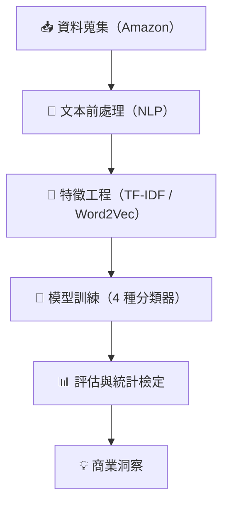

[English](./README.md) | **繁體中文** | 🌐 [互動式雙語頁面](https://iambakr.github.io/tfidf-vs-word2vec-gpu-reviews/)

# 📊 TF-IDF 與 Word2Vec 於情感分類之比較分析

### 以 Amazon 上 NVIDIA RTX 40 系列顯示卡評論為個案研究

> **碩士論文** ｜ 國立臺北大學統計學系  
> **作者：** 洪凱迪（Kai-Tih Hong）  
> **指導教授：** 黃怡婷 博士（Dr. Yi-Ting Hwang）  
> **日期：** 2025 年 7 月


---

## 🎯 重點摘要（TL;DR）

- 建置**端到端 NLP 流程**，將 2,989 篇 Amazon 顯示卡評論分類為正面／負面情感
- **Word2Vec（Skip-gram）在所有分類器上均顯著優於 TF-IDF**——驗證語意詞嵌入在特定領域文本中的優勢
- 偵測負面評論的最佳召回率（Recall）：**Word2Vec + XGBoost → 召回率 73.5%**
- 最佳均衡表現：**Word2Vec + SVM RBF → F1 = 0.694**
- 在 TF-IDF 流程中，mRMR 特徵選取被證實比互資訊（Mutual Information, MI）更有效率

---

## 📋 目錄

- [商業背景](#-商業背景)
- [研究問題](#-研究問題)
- [資料概覽](#-資料概覽)
- [方法論](#-方法論)
- [關鍵結果](#-關鍵結果)
- [商業應用](#-商業應用)
- [技術棧](#-技術棧)
- [專案結構](#-專案結構)
- [詳細文件](#-詳細文件)
- [關於作者](#-關於作者)

---

## 💡 商業背景

在加密貨幣挖礦、疫情期間遊戲需求與生成式 AI 浪潮的推動下，GPU 市場經歷了快速轉變。對於顯示卡這類高單價、規格複雜的產品，消費者高度仰賴**線上評論**來弭平資訊不對稱的落差。

**核心挑戰：** 製造商如何從數千篇非結構化評論中，系統性地萃取可付諸行動的洞察，以改善產品與顧客滿意度？

本研究透過比較兩種主流文本表示方法——**TF-IDF**（統計式）與 **Word2Vec**（語意式）——來回應此挑戰，判斷何者更能在高度技術性的產品評論中捕捉消費者情感。

---

## 🔬 研究問題

1. 在情感分類任務中，TF-IDF 與 Word2Vec 這兩種文本表示方法，何者更能捕捉充滿技術術語的消費者意見？
2. 不同的特徵選取方法（MI vs. mRMR）是否會產生顯著的效能差異？
3. 在此領域中，文本表示方法與機器學習分類器的最佳組合為何？

---

## 📦 資料概覽

| 屬性 | 說明 |
|---|---|
| **資料來源** | Amazon 美國站（僅限已驗證購買） |
| **產品** | NVIDIA RTX 40 系列顯示卡 |
| **品牌** | MSI（26.5%）、ASUS（33.5%）、GIGABYTE（40.0%） |
| **時間範圍** | 2022 年 10 月 – 2025 年 4 月 |
| **評論總數** | 2,989 篇（前處理後） |
| **標籤分布** | 正面（GOOD）：82.6% \| 負面（BAD）：17.4% |
| **訓練／測試切分** | 70/30 分層抽樣 |

### 🔍 消費者最關注議題（Bigram 分析）

| 排名 | Bigram | 頻次 | 洞察 |
|---|---|---|---|
| 1 | coil whine | 170 | 排名第一的硬體瑕疵抱怨（電流聲） |
| 2 | work great | 130 | 核心正面用語 |
| 3 | play game | 106 | 主要使用情境 |
| 4 | max setting | 102 | 效能跑分關注焦點 |
| 5 | power supply | 97 | 相容性疑慮 |

---

## ⚙️ 方法論




### 文本前處理流程
1. **標準化** — 轉小寫、移除 URL／HTML／表情符號／數字
2. **斷詞（Tokenization）** — 將文本切分為詞元
3. **停用詞移除** — Snowball + SMART 字典 + 領域專屬詞彙
4. **詞形還原（Lemmatization）** — 將字詞還原為原形（例如 "running" → "run"）
5. **領域校正** — 對應領域縮寫（例如 "fp" → "fps"）

### 特徵工程：兩條平行路徑

| 方法 | 原理 | 測試維度 |
|---|---|---|
| **TF-IDF** + MI 特徵選取 | 統計式詞彙重要性加權 | 258、517、776、1034、1292 |
| **TF-IDF** + mRMR 特徵選取 | 最小冗餘、最大相關性篩選 | 258、517、776、1034、1292 |
| **Word2Vec**（Skip-gram） | 語意詞嵌入 | 100、200、300 |

> 全部 13 組特徵集皆為**混合式**：文本特徵（上列維度）+ 22 個後設資料特徵（品牌／晶片／VRAM 的 one-hot 編碼、評論長度、圖片數等）。詳見 [`METHODOLOGY.zh-TW.md`](./METHODOLOGY.zh-TW.md) §2.3。

### 機器學習模型（4 種分類器 × 13 組特徵集 = 52 種配置）

| 模型 | 類型 | 選用理由 |
|---|---|---|
| **SVM Linear** | 線性分類器 | 高維度文本的基準模型 |
| **SVM RBF** | 非線性分類器 | 探索非線性決策邊界 |
| **Random Forest** | Bagging 集成 | 穩健的特徵重要性分析 |
| **XGBoost** | Boosting 集成 | 最先進的梯度提升方法 |

**驗證方式：** 10 折分層交叉驗證（Cross-Validation）× 重複 30 次 = 每模型 300 輪評估

---

## 📈 關鍵結果

### 🏆 各目標下的最佳模型

| 目標 | 最佳配置 | 效能 |
|---|---|---|
| **負評偵測最大化**（召回率） | Word2Vec 300 維 + XGBoost | **召回率 = 0.735** |
| **均衡表現**（F1） | Word2Vec 300 維 + SVM RBF | **F1 = 0.694** |
| **最佳 TF-IDF**（召回率） | mRMR 258 維 + SVM Linear | 召回率 = 0.626 |


### Word2Vec 與 TF-IDF 效能比較

#### Word2Vec 結果（300 維）

| 模型 | 準確率（Accuracy） | 精確率（Precision） | 召回率 | F1 分數（F1 Score） |
|---|---|---|---|---|
| SVM Linear | 0.865 | 0.591 | 0.710 | 0.645 |
| **SVM RBF** | **0.891** | **0.673** | 0.716 | **0.694** |
| Random Forest | 0.892 | 0.686 | 0.690 | 0.688 |
| **XGBoost** | 0.872 | 0.606 | **0.735** | 0.665 |

#### 最佳 TF-IDF 結果（MI 258 維）

| 模型 | 準確率 | 精確率 | 召回率 | F1 分數 |
|---|---|---|---|---|
| SVM Linear | 0.877 | 0.723 | 0.471 | 0.570 |
| SVM RBF | 0.880 | 0.724 | 0.490 | 0.585 |
| Random Forest | 0.883 | 0.684 | 0.600 | 0.639 |
| XGBoost | 0.846 | 0.549 | 0.619 | 0.582 |

> **關鍵發現：** Word2Vec 在所有分類器上持續優於 TF-IDF，**召回率高出 10–15%**、**F1 分數高出 5–10%**。

### 📊 統計顯著性（Friedman + Dunn's 檢定）

統計檢定證實效能差異**並非出於偶然**：
- **召回率：** Friedman χ²(51) = 11,827，p < 0.001
- **F1 分數：** Friedman χ²(51) = 9,811.3，p < 0.001

**統計上表現最佳的群組**（召回率 12 個模型、F1 8 個模型）以 Word2Vec 配置為主，僅有低維度的 mRMR 版 TF-IDF 得以入列。

---

## 💼 商業應用

### 1. 自動化消費者回饋分析
將 Word2Vec + SVM RBF／XGBoost 部署為電商平台**即時評論監測**的核心引擎——以可規模化的自動情感偵測取代人工閱讀。


### 2. 跨平台市場情報
研究中識別出的關鍵詞（如 "coil whine"（電流聲）、"dead arrival"（到貨即損）、"refund"（退款）、"RMA"（申請維修））可作為**監測字典**，用於追蹤品牌健康度，涵蓋：
- CRM 系統
- 社群媒體平台
- 社群論壇
- 影音平台留言

### 3. 產品改善洞察
負面評論聚類揭示可付諸行動的主題：
- **硬體瑕疵：** "coil whine"（電流聲）
- **DOA 問題：** "dead arrival"（到貨即損）
- **散熱疑慮：** "temperature"（溫度）、"thermal throttle"（過熱降頻）
- **相容性：** "power supply"（電源供應器）、"power cable"（電源線）、"case fit"（機殼空間）

### 4. 競品比較
此分析框架可自動比較**跨品牌**（MSI vs. ASUS vs. GIGABYTE）與**跨產品級距**（RTX 4060 vs. 4090）的消費者情感。

---

## 🛠 技術棧

| 類別 | 工具 |
|---|---|
| **語言** | R 4.5.0 |
| **NLP** | quanteda、stopwords、textstem |
| **詞嵌入** | word2vec（Skip-gram） |
| **ML 框架** | tidymodels、caret |
| **模型** | e1071（SVM）、ranger（RF）、xgboost |
| **統計** | PMCMRplus（Friedman／Dunn's 檢定） |
| **視覺化** | ggplot2、igraph（網絡圖） |
| **硬體** | Mac Mini M4 Pro（48GB RAM、16 核心 GPU） |

---

## 📂 專案結構

```
├── PAPER.md                        # 精簡版論文（商業導向，約 18 頁）
├── METHODOLOGY.md                  # 完整技術方法論
├── RESULTS.md                      # 全部 52 種模型配置
├── src/                            # R 分析腳本（前處理 → 特徵 → 模型 → 檢定）
├── results/                        # 結果圖表（召回率比較、維度衰減、召回率–F1）
└── data/
    ├── sample_reviews.csv          # 15 筆「合成」示範評論（見 data/README.md）
    └── README.md                   # 資料欄位說明 + 真實語料參考統計
```

所有分析程式碼皆以 **R** 撰寫（見上方技術棧）。所有報告結果均來自
真實的 2,989 篇評論語料，該語料不對外散布——詳見 [`data/README.md`](./data/README.md)。

---

## 📖 詳細文件

- 📄 [`PAPER.zh-TW.md`](./PAPER.zh-TW.md) — 精簡、商業導向的論文版本（建議由此開始閱讀）
- 📄 [`METHODOLOGY.zh-TW.md`](./METHODOLOGY.zh-TW.md) — 完整技術方法論，含公式、模型架構與超參數設定
- 📄 [`RESULTS.zh-TW.md`](./RESULTS.zh-TW.md) — 完整實驗結果，涵蓋全部 52 種模型配置

---

## 👤 關於作者

**洪凱迪（Kai-Tih Hong）**  
國立臺北大學統計學系碩士（2025）

🔗 [LinkedIn](https://www.linkedin.com/in/kaitih-hong-6289b164)   

### 核心能力
- **自然語言處理** — 文本前處理、特徵工程、詞嵌入
- **機器學習** — 分類、集成方法、超參數最佳化、交叉驗證
- **統計分析** — 無母數檢定、實驗設計、效能評估
- **數據驅動行銷** — 消費者情感分析、市場情報、競品比較
- **技術性產品分析** — GPU／硬體領域專業、電商數據分析

---

## 📜 引用

```bibtex
@mastersthesis{hong2025gpu,
  title={Comparative Analysis of TF-IDF and Word2Vec for Text Classification: 
         A Case of NVIDIA RTX 40 Series of Graphics Card Reviews on Amazon},
  author={Hong, Kai-Tih},
  year={2025},
  school={National Taipei University},
  department={Department of Statistics}
}
```

---

## 📄 授權

程式碼以 [MIT License](./LICENSE) 釋出。若引用本研究之發現，請引用原始論文（見上方「引用」段落）。
