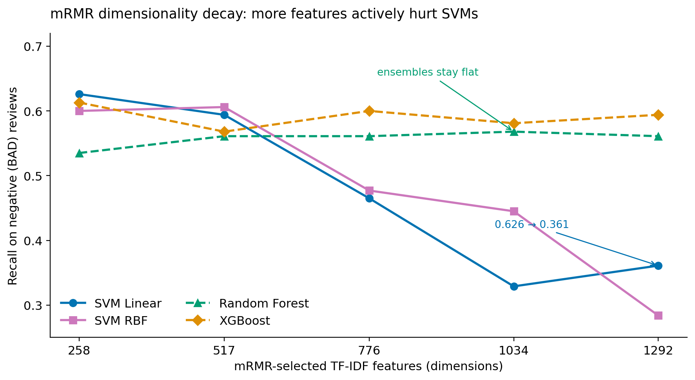

[English](./RESULTS.md) | **繁體中文**

# 📊 完整實驗結果

> 涵蓋 TF-IDF（MI 與 mRMR）與 Word2Vec 特徵集的全部 52 組模型配置。  
> 方法論細節請參閱 [`METHODOLOGY.zh-TW.md`](./METHODOLOGY.zh-TW.md)。

> [!NOTE]
> **本文件同時呈報兩種性質不同的數據——請勿混用。**
> 第 1–3 節呈報的是模型在**保留測試集**（897 筆評論，訓練過程中完全未接觸）上的單點效能——即面向實際部署的數據。第 4 節呈報的是 **300 輪交叉驗證的中位數**（於訓練集上進行 30 次重複之 10 摺交叉驗證）——即用於 Friedman/Dunn 統計檢定的分佈。因此，同一模型配置的 CV 中位數與測試集數值依設計會略有差異。

---

## 目錄

- [1. Word2Vec 結果](#1-word2vec-結果)
- [2. TF-IDF + MI 結果](#2-tf-idf--mi-結果)
- [3. TF-IDF + mRMR 結果](#3-tf-idf--mrmr-結果)
- [4. 統計顯著性分析](#4-統計顯著性分析)
- [5. 總結與結論](#5-總結與結論)

---

## 1. Word2Vec 結果

### 1.1 測試集效能

#### 300 維

| 模型 | 準確率（Accuracy） | 特異度（Specificity） | 精確率（Precision） | 召回率（Recall） | F1 分數 | 訓練時間（秒） |
|---|---|---|---|---|---|---|
| SVM Linear | 0.865 | 0.898 | 0.591 | 0.710 | 0.645 | **1,317** |
| **SVM RBF** | **0.891** | 0.927 | **0.673** | 0.716 | **0.694** | 1,825 |
| Random Forest | 0.892 | 0.934 | 0.686 | 0.690 | 0.688 | 3,646 |
| **XGBoost** | 0.872 | 0.900 | 0.606 | **0.735** | 0.665 | 6,101 |

#### 200 維

| 模型 | 準確率 | 特異度 | 精確率 | 召回率 | F1 分數 | 訓練時間（秒） |
|---|---|---|---|---|---|---|
| SVM Linear | 0.863 | 0.896 | 0.586 | 0.703 | 0.639 | **919** |
| **SVM RBF** | **0.890** | 0.929 | **0.673** | 0.703 | **0.688** | 1,238 |
| Random Forest | 0.886 | 0.927 | 0.665 | 0.690 | 0.677 | 3,302 |
| XGBoost | 0.883 | 0.925 | 0.645 | 0.684 | 0.669 | 4,489 |

#### 100 維

| 模型 | 準確率 | 特異度 | 精確率 | 召回率 | F1 分數 | 訓練時間（秒） |
|---|---|---|---|---|---|---|
| SVM Linear | 0.878 | 0.916 | 0.635 | 0.697 | 0.665 | **523** |
| **SVM RBF** | **0.891** | 0.930 | 0.677 | 0.703 | **0.690** | 697 |
| Random Forest | 0.881 | 0.926 | 0.652 | 0.665 | 0.658 | 2,771 |
| **XGBoost** | 0.886 | 0.920 | 0.655 | **0.723** | 0.687 | 2,726 |

### 1.2 泛化能力分析（訓練集 vs. 測試集）

#### 300 維

| 模型 | 資料 | 準確率 | 特異度 | 精確率 | 召回率 | F1 分數 |
|---|---|---|---|---|---|---|
| SVM Linear | 訓練集 | 0.902 | 0.907 | 0.665 | 0.874 | 0.755 |
| SVM Linear | **測試集** | 0.865 | 0.898 | 0.591 | 0.710 | 0.645 |
| SVM RBF | 訓練集 | 0.920 | 0.930 | 0.724 | 0.874 | 0.792 |
| SVM RBF | **測試集** | 0.891 | 0.927 | 0.673 | 0.716 | 0.694 |
| Random Forest | 訓練集 | 0.958 | 0.950 | 0.808 | 0.995 | 0.892 |
| Random Forest | **測試集** | 0.892 | 0.934 | 0.686 | 0.690 | 0.688 |
| XGBoost | 訓練集 | 0.931 | 0.927 | 0.732 | 0.948 | 0.826 |
| XGBoost | **測試集** | 0.872 | 0.900 | 0.606 | 0.735 | 0.665 |

> **觀察：** SVM 模型的訓練集與測試集差距最小，顯示泛化能力最佳。Random Forest 的差距最大（召回率：0.995→0.690），顯示有過度擬合的跡象。

---

## 2. TF-IDF + MI 結果

### 2.1 測試集效能

#### 258 維（10%）

| 模型 | 準確率 | 特異度 | 精確率 | 召回率 | F1 分數 | 訓練時間（秒） |
|---|---|---|---|---|---|---|
| SVM Linear | 0.877 | 0.962 | 0.723 | 0.471 | 0.570 | **1,453** |
| SVM RBF | 0.880 | 0.961 | 0.724 | 0.490 | 0.585 | 1,622 |
| Random Forest | **0.883** | 0.942 | 0.684 | 0.600 | **0.639** | 4,730 |
| XGBoost | 0.846 | 0.894 | 0.549 | **0.619** | 0.582 | 3,510 |

#### 517 維（20%）

| 模型 | 準確率 | 特異度 | 精確率 | 召回率 | F1 分數 | 訓練時間（秒） |
|---|---|---|---|---|---|---|
| SVM Linear | 0.878 | 0.960 | 0.717 | 0.490 | 0.582 | **2,933** |
| SVM RBF | **0.885** | 0.981 | **0.825** | 0.426 | 0.562 | 3,242 |
| Random Forest | 0.883 | 0.947 | 0.695 | 0.574 | **0.629** | 7,144 |
| XGBoost | 0.821 | 0.863 | 0.485 | **0.619** | 0.544 | 6,414 |

#### 776 維（30%）

| 模型 | 準確率 | 特異度 | 精確率 | 召回率 | F1 分數 | 訓練時間（秒） |
|---|---|---|---|---|---|---|
| SVM Linear | 0.882 | 0.970 | 0.763 | 0.458 | 0.573 | **4,648** |
| SVM RBF | 0.877 | 0.980 | **0.800** | 0.387 | 0.522 | 4,945 |
| Random Forest | **0.889** | 0.954 | 0.724 | 0.574 | **0.640** | 9,005 |
| XGBoost | 0.805 | 0.848 | 0.451 | **0.600** | 0.515 | 8,088 |

#### 1034 維（40%）

| 模型 | 準確率 | 特異度 | 精確率 | 召回率 | F1 分數 | 訓練時間（秒） |
|---|---|---|---|---|---|---|
| SVM Linear | 0.880 | 0.969 | 0.753 | 0.452 | 0.565 | **6,373** |
| SVM RBF | 0.882 | 0.981 | **0.818** | 0.406 | 0.543 | 6,904 |
| Random Forest | **0.890** | 0.950 | 0.715 | 0.600 | **0.653** | 10,425 |
| XGBoost | 0.817 | 0.860 | 0.477 | **0.613** | 0.537 | 11,224 |

#### 1292 維（50%）

| 模型 | 準確率 | 特異度 | 精確率 | 召回率 | F1 分數 | 訓練時間（秒） |
|---|---|---|---|---|---|---|
| SVM Linear | 0.872 | 0.966 | 0.722 | 0.419 | 0.531 | **8,663** |
| SVM RBF | 0.881 | 0.984 | **0.833** | 0.387 | 0.529 | 9,031 |
| Random Forest | **0.890** | 0.953 | 0.722 | 0.587 | **0.648** | 11,822 |
| XGBoost | 0.841 | 0.892 | 0.535 | **0.594** | 0.563 | 14,002 |

> **MI 小結：** XGBoost 持續達到最高的召回率（0.594–0.619）。SVM RBF 的召回率在較高維度下顯著衰退。Random Forest 在 F1 分數上領先。

---

## 3. TF-IDF + mRMR 結果

### 3.1 測試集效能

#### 258 維（10%）

| 模型 | 準確率 | 特異度 | 精確率 | 召回率 | F1 分數 | 訓練時間（秒） |
|---|---|---|---|---|---|---|
| **SVM Linear** | 0.835 | 0.879 | 0.519 | **0.626** | 0.567 | **1,345** |
| SVM RBF | 0.857 | 0.911 | 0.585 | 0.600 | 0.592 | 1,585 |
| Random Forest | **0.878** | 0.950 | **0.692** | 0.535 | **0.604** | 5,366 |
| XGBoost | 0.837 | 0.884 | 0.525 | 0.613 | 0.565 | 3,489 |

#### 517 維（20%）

| 模型 | 準確率 | 特異度 | 精確率 | 召回率 | F1 分數 | 訓練時間（秒） |
|---|---|---|---|---|---|---|
| SVM Linear | 0.797 | 0.840 | 0.436 | 0.594 | 0.503 | **2,782** |
| SVM RBF | 0.797 | 0.837 | 0.437 | **0.606** | 0.508 | 3,271 |
| Random Forest | **0.884** | 0.951 | **0.707** | 0.561 | **0.626** | 7,666 |
| XGBoost | 0.814 | 0.865 | 0.468 | 0.568 | 0.513 | 6,416 |

#### 776 維（30%）

| 模型 | 準確率 | 特異度 | 精確率 | 召回率 | F1 分數 | 訓練時間（秒） |
|---|---|---|---|---|---|---|
| SVM Linear | 0.834 | 0.911 | 0.522 | 0.465 | 0.491 | **4,434** |
| SVM RBF | 0.829 | 0.903 | 0.507 | 0.477 | 0.492 | 4,864 |
| Random Forest | **0.885** | 0.953 | **0.713** | 0.561 | **0.628** | 9,043 |
| XGBoost | 0.828 | 0.876 | 0.503 | **0.600** | 0.547 | 8,096 |

#### 1034 維（40%）

| 模型 | 準確率 | 特異度 | 精確率 | 召回率 | F1 分數 | 訓練時間（秒） |
|---|---|---|---|---|---|---|
| SVM Linear | 0.864 | 0.976 | 0.739 | 0.329 | 0.455 | **6,106** |
| SVM RBF | 0.863 | 0.950 | 0.651 | 0.445 | 0.529 | 6,762 |
| Random Forest | **0.889** | 0.956 | **0.727** | 0.568 | **0.638** | 10,717 |
| XGBoost | 0.808 | 0.856 | 0.457 | **0.581** | 0.511 | 11,141 |

#### 1292 維（50%）

| 模型 | 準確率 | 特異度 | 精確率 | 召回率 | F1 分數 | 訓練時間（秒） |
|---|---|---|---|---|---|---|
| SVM Linear | 0.873 | 0.980 | 0.789 | 0.361 | 0.496 | 8,006 |
| SVM RBF | 0.870 | 0.992 | **0.880** | 0.284 | 0.429 | **7,886** |
| Random Forest | **0.885** | 0.953 | 0.713 | 0.561 | **0.628** | 12,162 |
| XGBoost | 0.843 | 0.895 | 0.541 | **0.594** | 0.566 | 14,011 |

> **mRMR 小結：** 呈現明顯的「維度遞減」效應——SVM Linear 的召回率從 **0.626（258 維）→ 0.361（1292 維）** 一路下滑。低維度的 mRMR 特徵更為有效。

效能衰減集中於以邊距（Margin）為基礎的 SVM 模型；而樹系集成模型（Random Forest、XGBoost）在 258→1,292 維之間幾乎維持平穩——其內建的特徵子抽樣機制，能吸收 mRMR 在較高選取比例下所納入的冗餘、低關聯性詞彙。

---

## 4. 統計顯著性分析

### 4.1 召回率指標

**Friedman 檢定：** χ²(51) = 11,827，**p < 0.001** ✓

**效能最佳模型群組（12 組模型，與基準模型相比 p.adj ≥ 0.05）：**

| 排名 | 模型配置 | 召回率中位數 |
|---|---|---|
| 1 | mRMR 517d + SVM RBF | 0.757 |
| 2 | mRMR 517d + SVM Linear | 0.753 |
| 3 | mRMR 258d + SVM Linear | 0.750 |
| 4 | Word2Vec 100d + SVM Linear | 0.750 |
| 5 | Word2Vec 200d + SVM Linear | 0.750 |
| 6 | Word2Vec 300d + SVM Linear | 0.750 |
| 7 | Word2Vec 300d + SVM RBF | 0.730 |
| 8 | Word2Vec 100d + SVM RBF | 0.722 |
| 9 | Word2Vec 200d + SVM RBF | 0.722 |
| 10 | Word2Vec 200d + XGBoost | 0.722 |
| 11 | Word2Vec 300d + Random Forest | 0.722 |
| 12 | Word2Vec 300d + XGBoost | 0.722 |

### 4.2 F1 分數指標

**Friedman 檢定：** χ²(51) = 9,811.3，**p < 0.001** ✓

**效能最佳模型群組（8 組模型，與基準模型相比 p.adj ≥ 0.05）：**

| 排名 | 模型配置 | F1 分數中位數 |
|---|---|---|
| 1 | Word2Vec 100d + SVM RBF | 0.684 |
| 2 | Word2Vec 200d + SVM RBF | 0.684 |
| 3 | Word2Vec 300d + SVM RBF | 0.684 |
| 4 | Word2Vec 300d + Random Forest | 0.680 |
| 5 | Word2Vec 100d + Random Forest | 0.676 |
| 6 | Word2Vec 200d + Random Forest | 0.675 |
| 7 | Word2Vec 100d + SVM Linear | 0.674 |
| 8 | mRMR 258d + SVM RBF | 0.658 |

---

## 5. 總結與結論

### 主要發現

1. **Word2Vec > TF-IDF：** 針對領域專業的技術性評論，語義詞嵌入在所有指標上均顯著優於統計式詞彙加權。

2. **mRMR > MI：** 使用 TF-IDF 時，低維度的 mRMR 特徵選取表現優於 MI（互資訊），對 SVM 分類器尤其明顯。

3. **維度效應：** 就 TF-IDF+mRMR 而言，較低維度（258–517）優於較高維度；就 Word2Vec 而言，300 維略優於 100 維與 200 維。

4. **最佳召回率：** Word2Vec 300d + XGBoost（測試集：0.735）

5. **最佳 F1 分數：** Word2Vec 300d + SVM RBF（測試集：0.694）

6. **統計穩健性：** 研究結果經由 300 輪交叉驗證，以 Friedman 檢定與 Dunn's 檢定（搭配 Holm 校正）確認。

### 實務建議

| 使用情境 | 建議配置 |
|---|---|
| **最大化負評偵測** | Word2Vec 300d + XGBoost |
| **精確率與召回率的平衡取捨** | Word2Vec 100–300d + SVM RBF |
| **預算／速度受限** | Word2Vec 100d + SVM RBF（最快，F1 分數具競爭力） |
| **必須使用 TF-IDF（可解釋性需求）** | mRMR 258d + SVM Linear |
